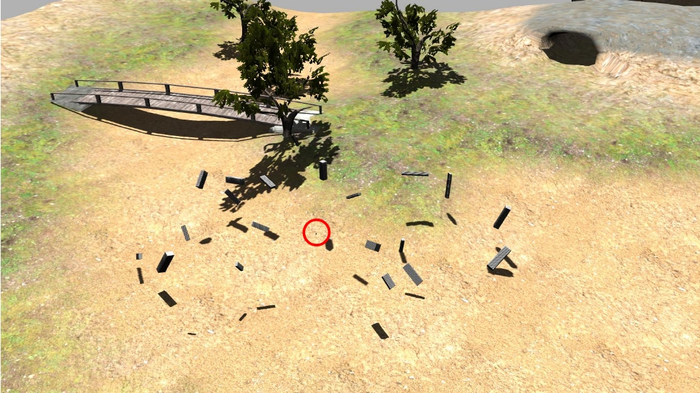
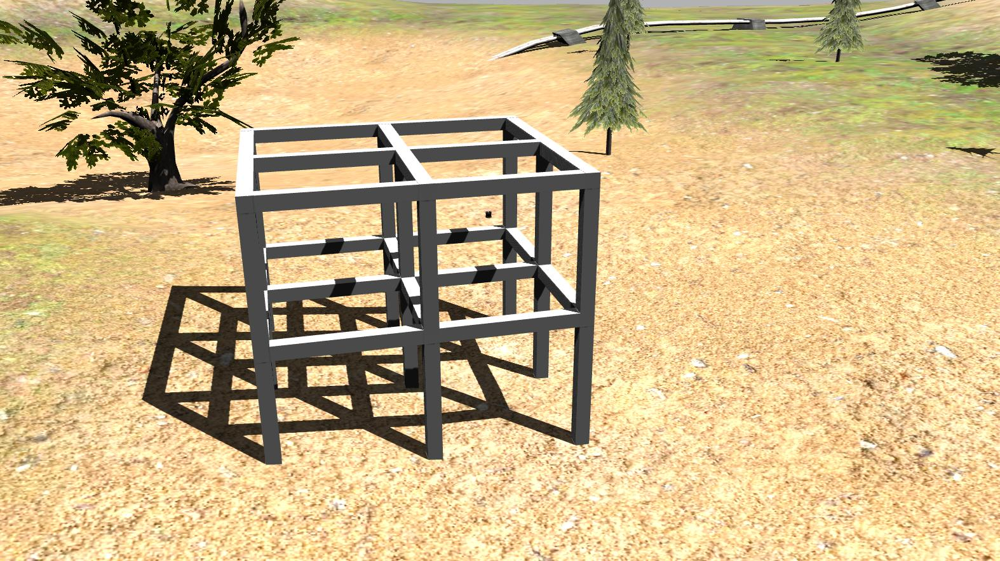

# Reticular Structures Ground Filter (rrss_grnd_filter)

Description
-----------
This repository contains a set of algorithms for filtering ground points from a 3D LiDAR scans in environments with reticular structures rising from the ground.

Its implementation has been carried out using the PCL (Point Cloud Library) library in C++ language.

* [PCL: Point Cloud Library](http://pointclouds.org/)

For more information see the article: [Comparative analysis of segmentation techniques for reticular structures](http://)

Example Datasets
----------------
* [Labelled paralellepipeds](https://arvc.umh.es/software/db/hyrecro/arvc_truss_train.zip)



* [Reticular structure](https://arvc.umh.es/software/db/hyrecro/arvc_truss_test.zip)
  


Citation
--------
If you use this code in your research, please cite the following paper:
```
@conference{FJSolerRRSSGF,
  author    = { Francisco Jose Soler and
                Adrián Peidró and
                David Valiente and
                Luis Payá and
                Oscar Reinoso},
  title     = {{Comparative analysis of segmentation techniques for reticular structures.}},
  month     = {Nov 13-15},
  year      = {2023},
  address   = {Rome, Italy},
  publisher = {}
}
```
